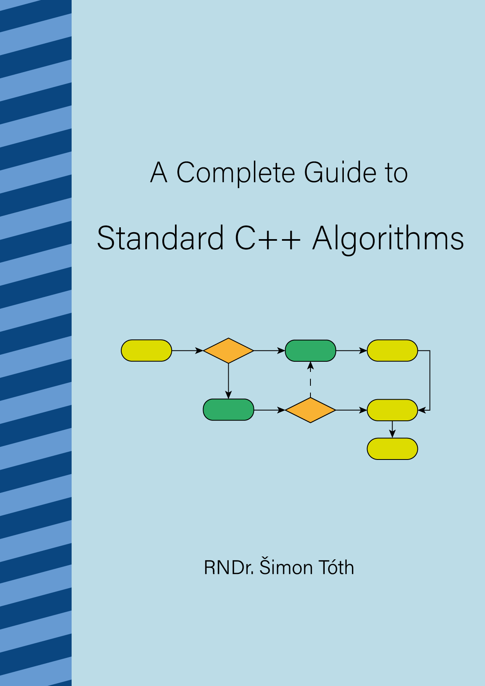

## A Complete Guide to Standard C++ Algorithms

Complete upto and including C++20.

- [Book repository](https://github.com/HappyCerberus/book-cpp-algorithms)
- [LeanPub](https://leanpub.com/cpp-algorithms-guide)

## Surviving the C++ Coding Interview

In progress book.

- [Book repository](https://leanpub.com/cpp-coding-interview)
- [LeanPub](https://leanpub.com/cpp-coding-interview)

## Daily bit(e) of C++

<ul>
<!-- SUBSTACK:START --><li><a href="https://simontoth.substack.com/p/daily-bite-of-c-conditional-explicit">Daily bit&lpar;e&rpar; of C++ | Conditional explicit</a></li><li><a href="https://simontoth.substack.com/p/daily-bite-of-c-stdstring_view">Daily bit&lpar;e&rpar; of C++ | std::string_view</a></li><li><a href="https://simontoth.substack.com/p/daily-bite-of-c-stdadvance-stddistance">Daily bit&lpar;e&rpar; of C++ | std::advance, std::distance</a></li><li><a href="https://simontoth.substack.com/p/daily-bite-of-c-stdiostream-custom">Daily bit&lpar;e&rpar; of C++ | std::iostream: custom manipulators</a></li><li><a href="https://simontoth.substack.com/p/daily-bite-of-c-event-booking">Daily bit&lpar;e&rpar; of C++ | Event booking</a></li><!-- SUBSTACK:END -->
</ul>