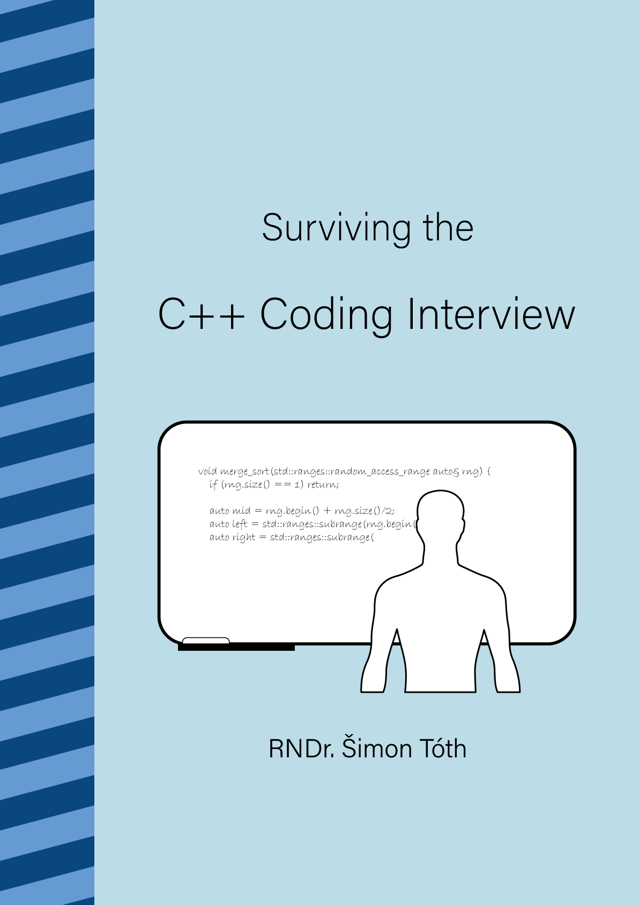

## A Complete Guide to Standard C++ Algorithms

Complete upto and including C++20.

- [Book repository](https://github.com/HappyCerberus/book-cpp-algorithms)
- [LeanPub](https://leanpub.com/cpp-algorithms-guide)

## Surviving the C++ Coding Interview

In progress book.

- [Book repository](https://leanpub.com/cpp-coding-interview)
- [LeanPub](https://leanpub.com/cpp-coding-interview)

## Daily bit(e) of C++

<ul>
<!-- SUBSTACK:START --><li><a href="https://simontoth.substack.com/p/daily-bite-of-c-c20-spaceship-operator">Daily bit&lpar;e&rpar; of C++ | C++20 &lpar;spaceship&rpar; operator&lt;=&gt; vs equality</a></li><li><a href="https://simontoth.substack.com/p/daily-bite-of-c-maximum-number-of-4a4">Daily bit&lpar;e&rpar; of C++ | Maximum number of office transfers</a></li><li><a href="https://simontoth.substack.com/p/daily-bite-of-c-thread_local">Daily bit&lpar;e&rpar; of C++ | thread_local</a></li><li><a href="https://simontoth.substack.com/p/daily-bite-of-c-maximum-subsequence">Daily bit&lpar;e&rpar; of C++ | Maximum subsequence dot product</a></li><li><a href="https://simontoth.substack.com/p/daily-bite-of-c-stdrangessubrange">Daily bit&lpar;e&rpar; of C++ | std::ranges::subrange</a></li><!-- SUBSTACK:END -->
</ul>